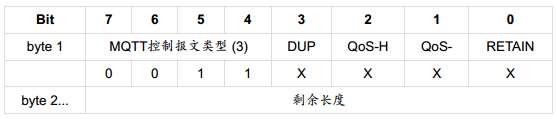

# QMTT Protocol

## MQTT协议特性

一句话总结：mqtt是一个简单，轻量的消息发布/订阅协议。

## MQTT报文结构

一个MQTT报文主要由三部分组成：固定报头（Fix Header），可变报头（Variable Header）和Payload。所有的报文都必须要有固定报头，而可变报头和Payload只有特定的消息才有。

### Fix Header

Fix Header使用一个Byte来标识，其中高四位用于控制报文类型。所以，MQTT最多能够表示16中报文类型。就目前v3.1.1版本来说，这4位并没有完全占用，还有两个保留值，分别是0和15。所以，MQTT有14种报文类型，下边会展开介绍。下边表格展示了每种报文类型其固定报头的值：

Fix Header中低四位是标志位（Flags），标志位没啥好说的，而且它的是也基本固定，我们大概看下不同的报文对应的标志位的值：

### Variable Header

除了固定报头，MQTT还制定了可变报头。可变报头只存在于部分报文中，并且不同的报文类型其可变报头也不一样。比如PUBLISH（QoS > 0时）， PUBACK，PUBREC，PUBREL，PUBCOMP，SUBSCRIBE, SUBACK， UNSUBSCIBE，UNSUBACK这些报文拥有一个两个字节长度的Package Identifier；CONNECT有四个可变报头：Protocol Name，Protocol Level，Connect Flags，Keep Alive。

### Payload

在可变报头后，紧接着就是Payload。Payload也是部分报文拥有。比如Publish消息，用它来存储推送的消息内容；Connect消息可用它来存储用户名密码，Subscribe可用它来存储订阅的主题名，等等。像PingReq，PingResp，PubAck等这些消息就没有Payload。下表展示了不同消息其Payload的情况：

### 剩余长度 Remaining Length

剩余长度是除了Fix Header以及剩余长度本身之外的报文大小。即，剩余长度=可变报头长度+Payload长度。MQTT规定用1~4个字节记录报文的剩余长度。其中每个自己的最高位用来标识是否有更多的数据，这样一个字节最大能表示数值128。4个字节是最大能表示268435455，也就是256M。

## MQTT报文概览

## Connect报文

### 固定报头

Connect报文的固定报头

### 可变报头

可变报头里幺蛾子比较多。它包含以下四个字段：协议名（Protocol Name），协议级别（Protocol Leven），链接标志（Connect Flags），保持链接（Keep Alive）。
协议名是固定的就是utf-8编码的`MQTT`，如果服务端发现协议名称不对，可以断开当前的链接，也可以继续处理，但是不能按照MQTT协议处理该报文。

协议级别也是固定的，对于MQTT 3.4.1是0x04。如果服务端接受到的客户端协议版本太低，则返回当前服务端不支持的协议级别，并断开当前链接。

链接标志包含的信息也非常复杂：

第0位是固定的保留位，服务端会检查这位是否为0，如果不是则断开链接。

第1位Clean Session，如果值为1的话表示服务端不会为客户端保留任何Session信息。所以也不存在客户端链接是恢复原有Session这一说。

当Clean Session为0时，如果服务端有与当前Client关联的Session，则基于当前Session进行通信；如果没有则创建新的Session。

我们看一下session都包含什么信息：

#### 客户端的会话状态包括：

- 已经发送给服务端，但是还没有完成确认的QoS 1和QoS 2级别的消息。
- 已从服务端接收，但是还没有完成确认的QoS 2级别的消息。

#### 服务端的会话状态包括：

- 会话是否存在，即使会话状态的其它部分都是空。
- 客户端的订阅信息。
- 已经发送给客户端，但是还没有完成确认的QoS 1和QoS 2级别的消息。
- 即将传输给客户端的QoS 1和QoS 2级别的消息。
- 已从客户端接收，但是还没有完成确认的QoS 2级别的消息。
- 可选，准备发送给客户端的QoS 0级别的消息。

### 遗嘱

Will包含三位：Will Flag是否在意外断开时发布遗嘱消息，Will Qos 消息的服务等级，Will Retain，是否保留。

#### 什么情况下会发布遗嘱消息：

- 服务端检测到了一个I/O错误或者网络故障。
- 客户端在保持连接（ Keep Alive） 的时间内未能通讯。
- 客户端没有先发送DISCONNECT报文直接关闭了网络连接。
- 由于协议错误服务端关闭了网络连接。

遗嘱消息都是发生在服务端认为客户端与自己断开了链接。遗嘱存在的意义就是能够让其它客户端及时的知道当前链接已经下线。

### Password和User Name

接下来是Password和User Name。这些都比较简单，如果有的话在Payload中填写相应的值即可。

## PUBLISH 报文

publish用于客户端向服务端或服务端向服务端发送消息。看一下它的消息格式。

### Fix Header

上边已经说过publish的固定报头是3，所以如下图固定报头的第四五位都是1。

然后publish是四个标识位，由低到高分别是：Retain，QoS（占用1，2两位），DUP。

### QoS

QoS标识消息的服务级别，MQTT规定了三种消息服务级别：
QoS 0：Fire and Forgot；
QoS 1：At Least Once；
QoS 2：Exectly Once。其中QoS2是最级别的协议。它需要经过两次服务端与客户端的通信才能完成： PUBLISH <-> PUBREC，PUBREL <-> PUBCOMP

实际应用中根据自己的应用特点选择不同的服务级别即可。

### Retain

如果客户端发送的retain标识为1，则服务端必须保存该条消息以及它的QoS。以便这个topic有新的订阅者订阅时，服务端要把这个消息推送给它。使用Retain的好处就是新的订阅者订阅成功之后便能得到最近的一条消息，无需等到下次产生消息时。

注意在协议文档中说道：`When a new subscription is established, the last retained message, if any, on each matching topic name MUST be sent to the subscriber.`。所以，每个retain 消息都会覆盖上一条，把这条消息最为最新保留消息。

如果服务器收到发送retain为true，payload为空的消息，它会把这个topic保留的retain消息删除。

如果服务器收到的 QoS 0 消息的保留标志设置为 1, 则它必须丢弃以前为该主题保留的任何消息。它应该将新的 QoS 0 消息存储为该主题的新保留消息, 但在任何时候都可以选择丢弃它, 如果发生这种情况, 该主题将不会有保留消息。