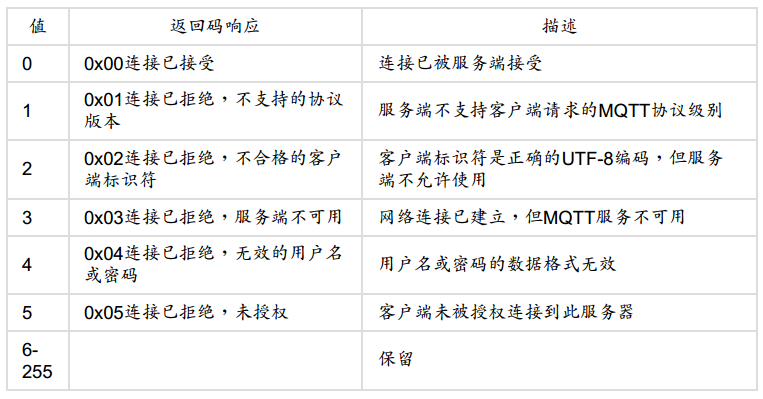

# MQTT Protocol

## MQTT协议特性

一句话总结：MQTT是一个简单，轻量的消息发布/订阅协议。

## MQTT报文结构

一个MQTT报文主要由三部分组成：固定报头（Fix Header），可变报头（Variable Header）和Payload。所有的报文都必须要有固定报头，而可变报头和Payload只有特定的消息才有。

### Fix Header

Fix Header使用一个Byte来标识，其中高四位用于控制报文类型。所以，MQTT最多能够表示16中报文类型。就目前v3.1.1版本来说，这4位并没有完全占用，还有两个保留值，分别是0和15。所以，目前MQTT有14种报文类型，下边会展开介绍。下边表格展示了每种报文类型其固定报头的值：

Fix Header中低四位是标志位（Flags），标志位没啥好说的，而且它们也基本是固定的，我们大概看下不同的报文对应的标志位的值：

### Variable Header

除了固定报头，MQTT还制定了可变报头。可变报头只存在于部分报文中，并且不同的报文类型其可变报头也不一样。比如PUBLISH（QoS > 0时）， PUBACK，PUBREC，PUBREL，PUBCOMP，SUBSCRIBE, SUBACK， UNSUBSCIBE，UNSUBACK这些报文拥有一个两个字节长度的Package Identifier；CONNECT有四个可变报头：Protocol Name，Protocol Level，Connect Flags，Keep Alive。

### Payload

在可变报头后，紧接着就是Payload。Payload也是部分报文拥有。比如PUBLISH，用它来存储推送的消息内容；CONNECT消息可用它来存储用户名密码，SUBSCRIBE可用它来存储订阅的主题名，等等。像PINGREQ，PINGRESP，PUBACK等这些消息就没有PAYLOAD。下表展示了不同消息其Payload的情况：

### 剩余长度 Remaining Length

剩余长度是除了Fix Header以及剩余长度本身之外的报文大小。即剩余长度=可变报头长度+Payload长度。MQTT规定用1~4个字节记录报文的剩余长度。其中每个字节的最高位用来标识是否有更多的数据，这样一个字节最大能表示数值128。4个字节是最大能表示268435455，也就是256M。

## MQTT报文概览

MQTT共有14种报文类型，这节主要介绍一下这些报文的作用。成对出现的报文会放在同一小节。

### CONNECT & CONNECTACK

CONNECT是客户端第一个发送的消息。客户端和服务器端建立TCP链接之后，应立即发送CONNECT消息。如果一段时间内客户端没有向服务端发送CONNECT消息，那么服务端应断开这个链接。服务端在收到CONNECT消息之后，应回复CONNECTACK消息。CONNECTACK消息包含了链接是否成功建立，或者为什么没有建立成功。

CONNECT指令相对复杂，下边我们详细介绍一下它包含的各部分内容。

#### 固定报头

#### 可变报头

可变报头内容较多，包含了以下四个字段：协议名（Protocol Name），协议级别（Protocol Leven），链接标志（Connect Flags），保持链接（Keep Alive）。

协议名是固定的，是以utf-8编码的`MQTT`，如果服务端发现协议名称不对，可以断开当前的链接，也可以继续处理，但是不能按照MQTT协议处理该报文。

协议级别也是固定的，对于MQTT 3.1.1是0x04。如果服务端接受到的客户端协议版本太低，则返回当前服务端不支持的协议级别，并断开当前链接。

#### Connect Flags

Connect Flags也包含了多种信息：

第0位是固定的保留位，服务端会检查这位是否为0，如果不是则断开链接。

第1位Clean Session，如果值为1的话表示服务端不会为客户端保留任何Session信息。所以也不存在客户端链接是恢复原有Session这一说。当Clean Session为0时，如果服务端有与当前Client关联的Session，则基于当前Session进行通信；如果没有则创建新的Session。

我们看一下session都包含什么信息：

##### 客户端的会话状态包括：

- 已经发送给服务端，但是还没有完成确认的QoS 1和QoS 2级别的消息。
- 已从服务端接收，但是还没有完成确认的QoS 2级别的消息。

##### 服务端的会话状态包括：

- 会话是否存在，即使会话状态的其它部分都是空。
- 客户端的订阅信息。
- 已经发送给客户端，但是还没有完成确认的QoS 1和QoS 2级别的消息。
- 即将传输给客户端的QoS 1和QoS 2级别的消息。
- 已从客户端接收，但是还没有完成确认的QoS 2级别的消息。
- 可选，准备发送给客户端的QoS 0级别的消息。

#### 遗嘱

Will包含三部分：Will Flag是否在意外断开时发布遗嘱消息；Will Qos 消息的服务等级；Will Retain，是否保留。

#### 什么情况下会发布遗嘱消息：

- 服务端检测到了一个I/O错误或者网络故障。
- 客户端在保持连接（ Keep Alive） 的时间内未能通讯。
- 客户端没有先发送DISCONNECT报文直接关闭了网络连接。
- 由于协议错误服务端关闭了网络连接。

遗嘱消息都是发生在服务端认为客户端与自己断开了链接。遗嘱存在的意义就是能够让其它客户端及时的知道当前链接已经下线。

#### Password和User Name

第6,7位是Password和User Name Flag。这些都比较简单，如果有的话在Payload中填写相应的值即可。

说完CONNECT报文，我们来看一下CONNECTACK，CONNECT我们主要说两个知识点：链接返回码，会话。

#### 链接返回码

连接返回码由可变报头的第二个字节表示。

#### Session Present

CONNECTACK的的一个字节是Connect Acknowledge Flags（链接确认标志）。链接确认标志的第0位是Session Present。如果CONNECT的CleanSession标志设置为1，SessionPresent需设置为0。如果Clean Session设置为0，如果服务端有关于当前Client的Session，则Session Present设置为1，否则设置为0。

### PUBLISH & PUBACK

PUBLISH用于客户端，服务端之间的消息推送。PUBACK是一方收到PUBLISH之后向另一方发送应答消息。下面我们先解释一下PUBLISH消息。

#### 固定报头

然后publish是四个标识位，由低到高分别是：Retain（消息是否保留），QoS（消息质量等级），DUP（是否是旧报文重发）。

##### QoS

QoS标识消息的服务级别，MQTT规定了三种消息服务级别：
QoS 0：Fire and Forgot；
QoS 1：At Least Once；
QoS 2：Exectly Once。其中QoS2是最级别的协议。它需要经过两次服务端与客户端的通信才能完成： PUBLISH <-> PUBREC，PUBREL <-> PUBCOMP

实际应用中根据自己的应用特点选择不同的服务级别即可。

##### Retain

如果客户端发送的retain标识为1，则服务端必须保存该条消息以及它的QoS。以便这个topic有新的订阅者订阅时，服务端要把这个消息推送给它。使用Retain的好处就是新的订阅者订阅成功之后便能得到最近的一条消息，无需等到下次产生消息时。

注意在协议文档中说道：`When a new subscription is established, the last retained message, if any, on each matching topic name MUST be sent to the subscriber.`。所以，每个retain 消息都会覆盖上一条，把这条消息最为最新保留消息。

如果服务器收到发送retain为true，payload为空的消息，它会把这个topic保留的retain消息删除。

如果服务器收到的 QoS 0 消息的保留标志设置为 1, 则它必须丢弃以前为该主题保留的任何消息。它应该将新的 QoS 0 消息存储为该主题的新保留消息, 但在任何时候都可以选择丢弃它, 如果发生这种情况, 该主题将不会有保留消息。

### 可变报头

报头包含了Topic Name和Packet Identifier。当QoS为1或2时Packaet Identifier才有，Packet Identifier可以重复利用，只要消息被确认它的Packet Identifier便可被其他消息使用。Packet Identifier最大占用两位，最大数值65536。

### PUBLISH & PUBREC & PUBREL & PUBLCOMP

如果QoS等级为2的话客户端和服务端要经过两个来回的通信过程：PUBLISH <-> PUBREC，PUBREL <-> PUBCOMP。这样可以实消息Exactly Once推送。

### SUBSCRIBE & SUBACK

SUBSCRIBE表示客户端向服务端订阅订阅感兴趣的一个或多个主题。服务端会维护主题和订阅关系，如果多个客户端订阅了同一个主题，其中任何一个客户端发送消息时，服务端需要把这个消息PUBLISH给其他订阅客户端。当服务端收到SUBSCRIBE时它会立即回复SUBACK。

### UNSUBSCRIBE & UNSUBACK

这两个消息用于取消订阅和取消订阅确认。

### PINGREQ & PINGRESP

PINGREQ，PINGRESP是客户端和服务端之间的心跳检测。在CONNECT命令里，会设置keepalive时间，如果在keepalive 1.5倍时间内服务端没有收到任何客户端消息则会把该客户端强制断开。因此如果客户端在没有其它消息向服务端发送时，应该定时在合理的时间内向服务器发送PINGREQ指令。服务端收到该指令后会回复PINGRESP。客户端如果在合理的时间内没有收到响应则应关闭链接。

### DISCONNECT

这是客户端发送给服务端的最后一个命令。在发送了这个命令之后客户端应该立即断开链接，并且不能通过这个链接再发送任何消息。服务端在收到这个消息之后，删除与当前链接关联的未发布的遗嘱消息，如果客户端还没断开链接，服务端关闭链接。