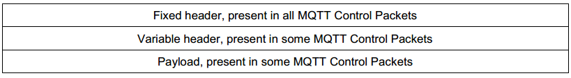
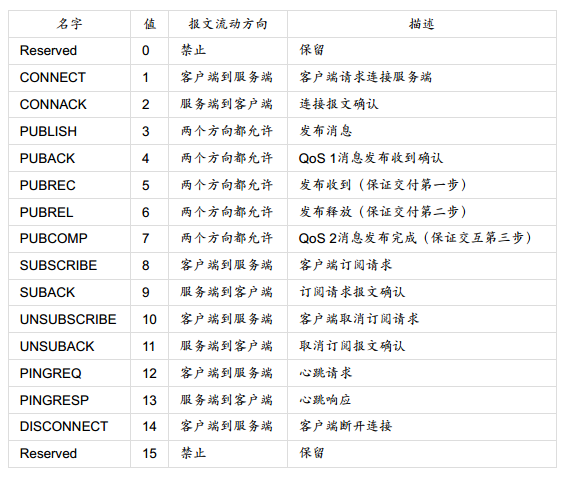
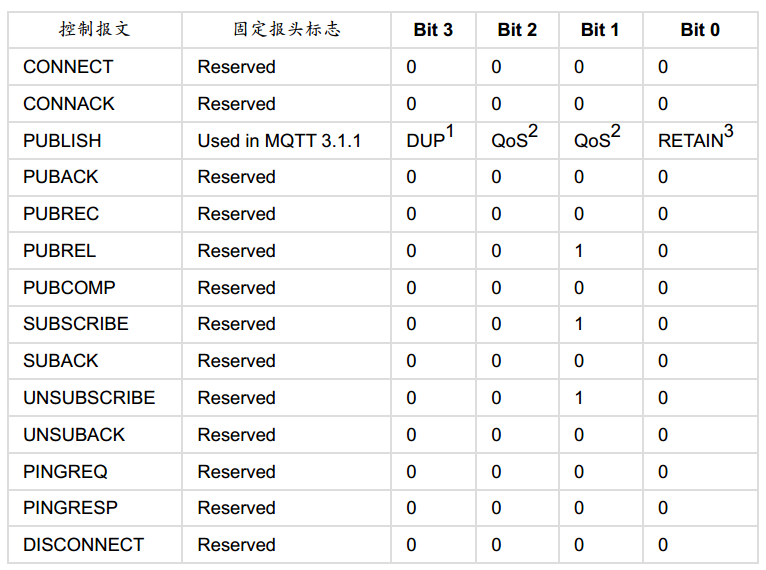
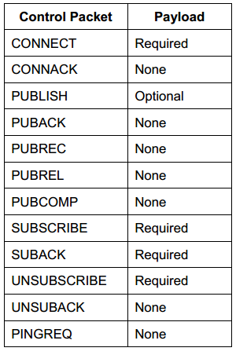
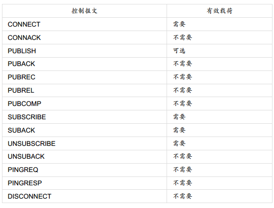

# QMTT Protocol

## 协议格式

MQTT协议主要有三部分组成：固定报头（Fix Header），可变报头（Variable Header）和Payload。其中固定报头是必需字段，可变报头和Payload均是可选字段。

### Fix Header

Fix Header占用一个Byte，其中高四位用于控制报文类型，其中第0和15位是预留位，因此MQTT只有14种报文类型。

Fix Header中低四位是标志位（Flags），不同的报文类型其标志位的值如下：

在可变报头后边，紧接着就是Payload。和可变报头一样，并不是所有的报文都有Payload。

### 剩余长度 Remaining Length

从第二个字节开始，MQTT协议规定用1~4个字节记录报文的剩余长度。剩余长度不包括固定报头和报文长度占用的字节。所以，报文长度=可变报头长度+Payload长度。每个byte 低7位用于编码数据，剩下的最高位用于标识是否还有更多数据。所以，mqtt最大长度可达256M，对应字节数268435455。

### Variable Header
在Remainnig Length后边是Variable Header。可变报头存在于部分报文中，不同的报文类型其可变报头也不一样。比如PUBLISH（QoS > 0时）， PUBACK，PUBREC，PUBREL，PUBCOMP，SUBSCRIBE, SUBACK， UNSUBSCIBE，UNSUBACK这些报文拥有一个两个字节长度的Package Identifier；CONNECT有四个可变报头：Protocol Name，Protocol Level，Connect Flags，Keep Alive

## Connect报文

### 固定报头

Connect报文的固定报头

### 可变报头

可变报头里幺蛾子比较多。它包含以下四个字段：协议名（Protocol Name），协议级别（Protocol Leven），链接标志（Connect Flags），保持链接（Keep Alive）。
协议名是固定的就是utf-8编码的`MQTT`，如果服务端发现协议名称不对，可以断开当前的链接，也可以继续处理，但是不能按照MQTT协议处理该报文。

协议级别也是固定的，对于MQTT 3.4.1是0x04。如果服务端接受到的客户端协议版本太低，则返回当前服务端不支持的协议级别，并断开当前链接。

链接标志包含的信息也非常复杂：

第0位是固定的保留位，服务端会检查这位是否为0，如果不是则断开链接。

第1位Clean Session，如果值为1的话表示服务端不会为客户端保留任何Session信息。所以也不存在客户端链接是恢复原有Session这一说。

当Clean Session为0时，如果服务端有与当前Client关联的Session，则基于当前Session进行通信；如果没有则创建新的Session。

我们看一下session都包含什么信息：

#### 客户端的会话状态包括：

- 已经发送给服务端，但是还没有完成确认的QoS 1和QoS 2级别的消息。
- 已从服务端接收，但是还没有完成确认的QoS 2级别的消息。

#### 服务端的会话状态包括：

- 会话是否存在，即使会话状态的其它部分都是空。
- 客户端的订阅信息。
- 已经发送给客户端，但是还没有完成确认的QoS 1和QoS 2级别的消息。
- 即将传输给客户端的QoS 1和QoS 2级别的消息。
- 已从客户端接收，但是还没有完成确认的QoS 2级别的消息。
- 可选，准备发送给客户端的QoS 0级别的消息。

### 遗嘱

Will包含三位：Will Flag是否在意外断开时发布遗嘱消息，Will Qos 消息的服务等级，Will Retain，是否保留。

#### 什么情况下会发布遗嘱消息：

- 服务端检测到了一个I/O错误或者网络故障。
- 客户端在保持连接（ Keep Alive） 的时间内未能通讯。
- 客户端没有先发送DISCONNECT报文直接关闭了网络连接。
- 由于协议错误服务端关闭了网络连接。

遗嘱消息都是发生在服务端认为客户端与自己断开了链接。遗嘱存在的意义就是能够让其它客户端及时的知道当前链接已经下线。

### Password和User Name

接下来是Password和User Name。这些都比较简单，如果有的话在Payload中填写相应的值即可。

### QoS

MQTT规定了三种消息服务级别
QoS0：Fire and Forgot；
QoS1：At Least Once；
QoS2：Exectly Once。其中QoS2是最级别的协议。它需要经过两次服务端与客户端的通信才能完成： Publish <-> PubRec，PubRel <-> PubCOMP

### Retain

