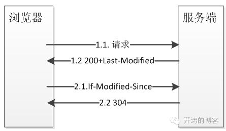

# REST API 设计规范

## REST

REST是一种架构风格, 而REST API是一种设计规范. 借助于Http的一些特性可以很好的实现REST风格的API. REST最重要的一点是资源的概念, 比如订单, 用户都可以抽象为资源, 加上Http提供的method, 可以对外提供一套标准的规范化的API.

### Http method

- POST: 表示创建一个资源.
- PUT: 表示对一个已有的资源进行替换.
- PATCH: 表示更新一个资源的部分属性.
- DELETE: 删除一个资源.
- GET: 读取资源.

其中GET, DELETE, PUT应该满足幂等性要求. 幂等性说的是什么呢? 在相同的数据和参数下执行一次和多次产生的效果是一样的.

### Http header

- Accept: 表示客户端接受什么格式的数据类型(json/xml). 如果客户端要求后端不能处理的数据类型, 可以返回406 Not-Acceptable.
- Content-Type: 表示返回的数据类型.
- If-None-Match/If-Modified-Since: 客户端提供某个条件, 如果条件满足才返回数据, 如果不满足则返回304 Not Modified. 如果客户端已经缓存了数据, 查询数据有没有改变时可以带上这两个Header.

Http缓存起作用流程图:

- If-Match: 对某个资源做PUT/Patch/Delete是可以带上这个Header, 配合服务端提供的ETag可以控制只有Etag匹配操作才会继续执行. ETag放在Response的header中.

### Http Status Code

200: Success
201: Created
204: No Content
304: Not Modified
400: Bad Request
403: Forbidden
404: Not Found
405: Method Not Allowed
406: Not Acceptable
412: Precondition Failed
429: Too Many Requests
500: Internal Server Error
502: Bad GateWay
503: Service Unavailable
504: Gateway Timeout

## 安全性

### 数据校验

- 是否携带了未要求的Header.
- Request Uri和Request Body是否合法. Request Body是否携带了不合法的参数, Query String是否携带了不合法的参数. 如果验证不合规则, 应立即返回4XX.

### 权限控制

#### OAUTH2

#### JWT

## 其他

### 访问限制

### Metrics

### 文档和调试