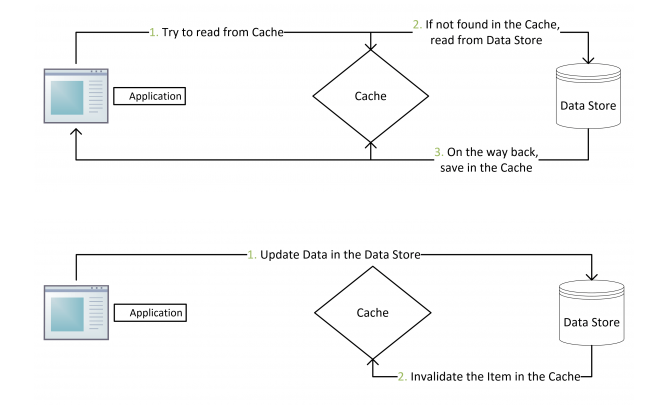
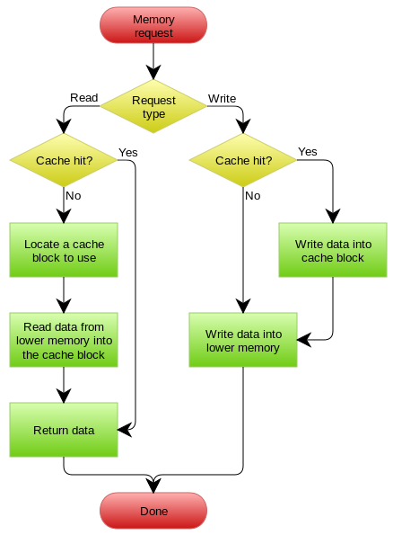
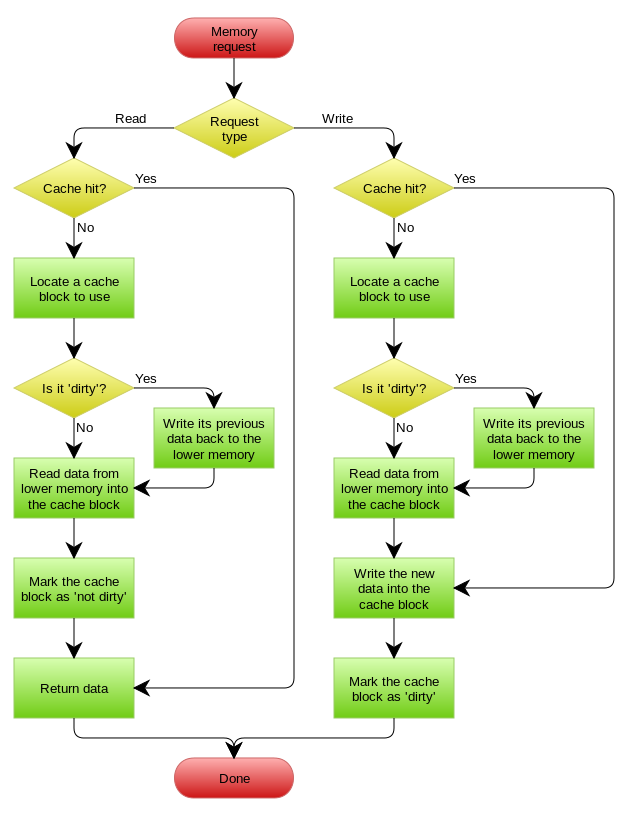

# About Cache

作后端开发的同学，缓存是必备技能。这是你不需要花费太多的精力就能显著提升服务性能的灵丹妙药。前提是你得知道如何使用它，这样才能够最大限度发挥它的功效，并抑制其副作用。本文将介绍最如何正确的添加和更新缓存。

## 开始之前

这部分将介绍在开始加缓存之前我们必须要做的事情。这步非常重要，如果没弄好，很有可能加了缓存反而不如不加。

为什么要用缓存？对于一个服务其性能瓶颈往往都在DB，传统关系型存储尤甚。我们在创建表的时候，并不会未所有的字段创建索引，这意味着如果我们需要读取非缓存数据就要从磁盘拿数据。这个过程至少需要十几毫秒的时间。而缓存往往是基于内存的，这要比DB读数据快两个数量级。这是我们用缓存的根本原因。

那干脆把所有的数据扔到内存不就行了嘛！不行。内存这东西虽然很快，同时它还很贵。动辄百十来G的数据都扔内存这有点太浪费。依据二八定律，我们只需找到那最紧俏的百分之二十就行了。这是非常重要的。否则你加了缓存效果反而更差。

对于缓存有一个衡量指标，叫做缓存命中率。这个指标高说明我们请求的数据大部分来自缓存。证明我们加缓存这件事的收益越高。

## 加缓存

如果你平时都用一些ORM工具很可能下边这些问题你不会直接遇到，不过这些问题都是在你加缓存之前需要着实想清楚的。算是一些通用的套路。我们逐条来看一下：

### 缓存穿透

缓存穿透是说访问一个缓存中没有的数据，但是这个数据数据库中也不存在。普通思路下我们没有从数据库中拿到数据是不会触发加缓存操作的。这时如果是有人恶意攻击，大量的访问就会透过缓存直接打到数据库，对后端服务和数据库做成巨大的压力甚至宕机。

解决方案：

- 缓存空对象。如果缓存未命中，而数据库中也没有这个对象，则可以缓存一个空对象到缓存。如果使用Redis，这种key需设置一个较短的时间，以防内存浪费。

- 缓存预测。预测key是否存在。如果缓存的量不大可以使用hash来判断，如果量大可以使用布隆过滤器来做判断。

### 缓存并发

缓存并发这个场景很容易解释：多个客户端同时访问一个没有在cache中的数据，这时每个客户端都会执行从DB加载数据set到缓存，就会造成缓存并发。

解决方案：

- 缓存预热。提前把所有预期的热数据加到缓存。定位热数据还是比较复杂的事情，需要根据自己的服务访问情况去评估。这个方案只能减轻缓存并发的发生次数不能全部抵制。

- 缓存加锁。 如果多个客户端访问不存在的缓存时，在执行加载数据并set缓存这个逻辑之前先加锁，只能让一个客户端执行这段逻辑。

### 缓存防雪崩

缓存雪崩是缓存服务暂时不能提供服务，导致所有的请求都直接访问DB。

解决方案：

- 构建高可用的缓存系统。目前常用的缓存系统Redis和Memcache都支持高可用的部署方式，所以部署的时候不防先考虑是否要以高可用的集群方式部署。

- 限流。Netflix的Hystrix是非常不错的工具，在用缓存时不妨搭配它来使用。

## 更新缓存

这部分我们将介绍一下cache的更新策略。这部分内容主要是来自CoolShell 左耳朵耗子老师，文末有原文地址，大家可以前去拜读。

### Cache Aside Pattern

这种思路先更新数据库，更新成功之后再令缓存失效。还有一种方式是先失效缓存，然后在更新数据库。我们来对比一下这两种方式的不同。

首先，来看后一种。设想一种情景，一个客户端发起更新操作，当执行了缓存失效。这时一个读取操作进来，发现缓存没有数据然后从数据库拿数据并放到缓存。更新操作继续更新数据库。这时缓存里已经缓存了脏数据。

那么第一种会出现这种问题吗？理论上是会的，看一下这个操作：A客户端发起更新操作，B客户端发起读操作，并且这时缓存恰好失效，然后它从数据库加载数据（老数据）。A的更新操作完成失效缓存，这时B读取的客户端把老数据set到缓存。这有这种情况下才会出现脏数据，但是这概率已经非常小了。

###　Read/Write Through Pattern

Read Through：读取数据的时候如果当前缓存中没有数据，惯常的操作都是应用程序去DB加载数据，然后加入到缓存中。Read Through与之不同的是我们不需要在应用程序自己加载数据了，缓存层会帮忙做件事。

Write Through：更新数据的时候，如果命中缓存，则先更新缓存然后缓存在负责把数据更新到数据库；如果没有命中缓存则直接更新数据库。

这种方式缓存层直接屏蔽了DB，应用程序只需要更缓存打交道。优点是应用逻辑简单了，而且更高效了；缺点是缓存层的实现相对复杂一些。

### Write Back Pattern

这是三种中实现难度最大的一种方式，它需要一个专门的存储保存缓存是否是脏数据，并在读写缓存时同步脏数据。在数据一致性要求不太高的场景可以使用这种方式。

首先我们来看一下读缓存的操作。如果缓存命中直接返回。如果缓存没有命中，则首先去strore中检索这个key是否dirty，如果不是则加载数据，如果是应先把数据flush到存储，然后在加载数据。接下来标记这条key为not dirty，返回结果。

写数据的过程。如果命中缓存则更新数据，并标记这条记录为dirty。如果没有命中，则去store中检索这个可以是否dirty，如果不是则从存储load数据，更新这条数据，如果是则把当前数据flush到存储，然后load数据更新，并标记这条记录为dirty。

## 参考

- [Cache_(computing)](https://en.wikipedia.org/wiki/Cache_(computing))

- [缓存更新的套路](http://coolshell.cn/articles/17416.html)