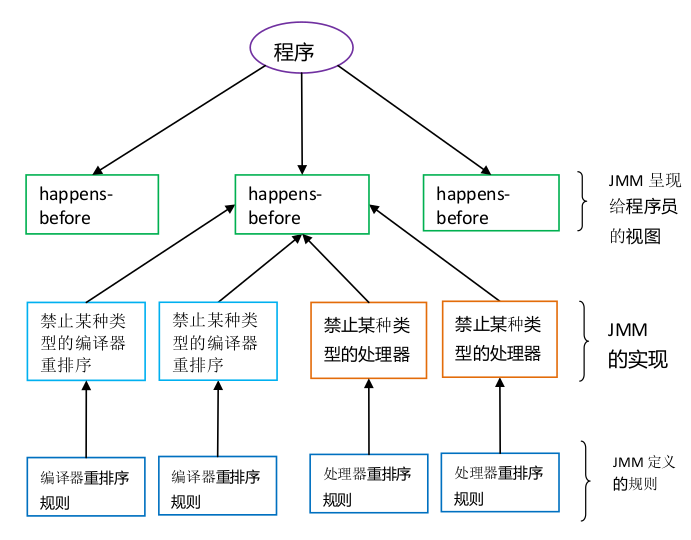

1. Jmm
JMM 通过控制主内存与每个线程的本地内存之间的交互,来为 java 程序员提供内存可见性保证。

2. 重排序
在执行程序时, 为了提高性能, 编译器和处理器常常会对指令做重排序. 重排序有三类:
- 编译器优化的重排序. 编译器(javac)在不改变程序单线程程序语义的前提下, 可以重新安排语句的执行顺序. 
- 指令级并行的冲排序. 处理器采用了指令并行技术将多条语句重叠执行. 
- 内存系统的重排序. 由于处理器使用缓存和读/写缓冲区,这使得加载和存储操作看上去可能是在乱序执行。

源代码 -> 编译器重排序 -> 指令级并行重排序 -> 内存系统重排序 -> 最终执行.

3. happens before规则
- 程序顺序规则. 按照程序的顺序, 书写在前面的操作先于后边的操作. 有时这个规则会被打破:

```java
int i = 1;
int ii = 2;
int iii = i + ii;
```
因为i和ii之间没有内存可见性的问题, 所以ii可能先于i发生. 

- 监视器锁规则. 一个锁的unlock操作, 先于后边对这个锁的lock操作.
- volatile 变量规则. 对一个volatile变量的写操作先于对这个变量的读操作.
- 传递性. 
- 线程启动规则. 线程的start方法先于方法内的每一个操作.
- 线程终止规则. 线程中的所有操作先于线程的stop方法.
- 线程中断规则. interrupt方法先于线程检测到中断事件. 
- 对象终结规则. 对象的初始化完成先于finalize方法. 

happens before规则可以禁用一个或者多个指令重排序. 



4. 数据依赖

写后读: `a = 1; b = a`
读后写: `b = a; a = 1`
写后写: `a = 1; a = 2`

编译器和处理器在重排序是会遵守数据依赖性. 但是这只是针对单个处理器的, 多个处理器时可能会有问题.

5. as-if-serial 语义

不管编译器和处理器怎么做重排序, 程序的执行结果不能改变.

6. 数据竞问题描述: 在一个线程中写一个变量, 在另一个线程中读一个变量, 且写和读没有通过同步来排序. 这种情况下可能读到错误的结果.

7. volatile语义
- 可见性: 对一个volatile的读, 总能看到对这个变量最后一次的写入. 
- 原子性: 对任意单个volatile的读写具有原子性.

从内存语义的角度来说: 
volatile的写和锁的释放有相同的内存语义；volatile的读和锁的获取有相同的语义.

当写一个volatile的变量时, JMM会把线程对应的本地内存刷到主内存. 
当读一个volatile的变量时, JMM会吧本地内存的变量置为无效, 然后去主内存读取. 

8. volatile和内存屏障
- 在每个 volatile 写操作的前面插入一个 StoreStore 屏障。
- 在每个 volatile 写操作的后面插入一个 StoreLoad 屏障。
- 在每个 volatile 读操作的后面插入一个 LoadLoad 屏障。
- 在每个 volatile 读操作的后面插入一个 LoadStore 屏障。

9. final
- 在构造函数内对一个 final 域的写入,与随后把这个被构造对象的引用赋值给一个引用变量,这两个操作之间不能重排序。

- 初次读一个包含 final 域的对象的引用,与随后初次读这个 final 域,这两个操作之间不能重排序。