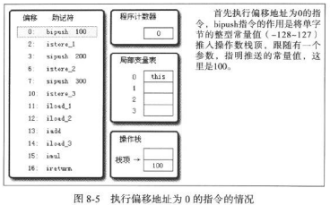
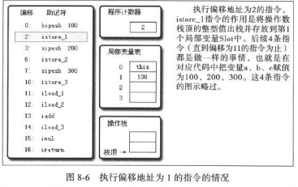
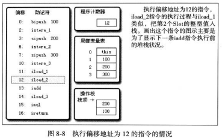
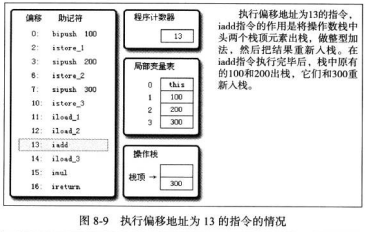
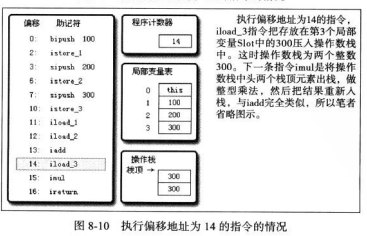
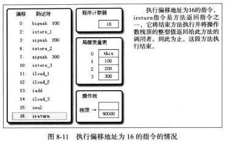

# JVM字节码执行过程

## 运行时栈帧结构

Jvm虚拟机栈是由栈帧构成的, 没一个方法从调用到开始都代表着一个栈帧的入栈到出栈的过程. 栈帧结构组成如下: 局部变量表, 操作数栈, 动态链接, 方法返回地址, 附加信息. 如下图示:


局部变量表以slot为最小单位, 一个slot的大小应该能够容纳: boolean, byte, char, short, reference和returnAddress. 基本上32就能搞定. long和double需要占用两个连续的slot. 

虚拟机中通过index来访问对应的slot, 如果访问的是long类新需要访问index和index+1两个. 局部变量表中第0号位置默认是用于传递方法所属对象实例的引用. 在方法中可以通过this来访问这个隐含的参数. 

slot是可以重用的, 如果方法中超过了一个参数的作用域, 则这个slot可以被其他变量重用.

操作数栈是一个后入先出的栈, 和局部变量一样站的深度都是在编译是写入到Code属性的. 32位数据类型占用1个栈容量, 64为的占用两个. 操作数栈是用来作计算的主要场所, 比如执行iadd操作, 把现在操作数栈中的两个数据相加把结果入栈. 

操作数栈中的元素顺序要与字节码指令的序列严格匹配, 编译是要保证这一点. 

动态链接是方法运行时确定引用的是那个方法. 

方法返回地址记录方法被调用的地址, 不论是正常退出还是异常中断, 都需要返回到方法调用位置. 

## 方法调用

### 解析

符号引用: 只是通过一组符号定位到所引用的目标. 
直接引用: 直接引用是执行目标的指针, 相对偏移量, 或是能够定位到目标的句柄

所有的方法调用中的目标方法在Class文件里都是一个常量池中的符号引用. 在类加载阶段, 会将其中的一部分符号引用转化为直接引用(内存地址). 

编译器可知, 运行期不变符合这个约束的方法只有: 静态方法和私有方法.

字节码指令
invokestatic: 调用静态方法
invokespecial: 调用实例构造器的<init>方法, 私有方法和父类方法
invokeinterface: 调用所有的虚方法
invokedynamic: 现在运行时动态解析出调用点限定符所引用的方法, 然后在执行该方法. 

只要能够被invokestatic和invokespecial指令调用的方法, 都可以在解析阶段确定唯一的调用版本. 符合这个条件的有静态方法, 私有方法, 实例构造器, 弗雷方法. 

解析阶段是一个静态的过程, 在编译期间就完全确定, 在类装载解析阶段就会把涉及的符号引用转变为直接引用, 不会等到运行期去完成. 

### 静态分派

Parent是Son的外观类型, Son是Parent的实际类型. 静态类型在编译期可知, 实际类型变化的结果则到运行期才可确定. 编译器在编译阶段并不知道一个类型的实际类型. 

```java
public class StaticDispatchExample {
    static abstract class Parent {
    }

    static class Son extends Parent {
    }

    void print(Parent parent) {
        System.out.println("parent speaking");
    }

    void print(Son son) {
        System.out.println("son speaking");
    }

    public static void main(String[] args) {
        final Parent son = new Son();

        final StaticDispatchExample ex = new StaticDispatchExample();
        ex.print(son); // parent speaking
    }

}
```

所有依赖静态类型来定位方法执行版本的分派动作成为静态分派, 典型应用是方法重载. 静态分派发生在编译阶段, 静态分派的动作实际不有虚拟机来执行. 

### 动态分派

invokevirtual指令运行时解析过程: 
1. 找到操作数栈顶的第一个元素所指向的对象的实际类型记作C
2. 如果类型C中找到常量中的描述符和简单名称都相符的方法, 进行访问权限校验, 如果通过则返回这个方法的引用, 查找结束；如果不通过, 返回java.lang.IllegalAccessError异常. 
3. 按照继承关系依次对C的各个父类进行第2布的搜索和验证.
4. 如果没有找到合适的方法抛出java.lang.AbstractMethodError. 

运行期根据实际类型确定发发执行版本的分派过程成为动态分派. 

## 基于栈的字节码执行

基于栈的指令集优点是可移植, 而缺点是比基于寄存器的要慢. 






