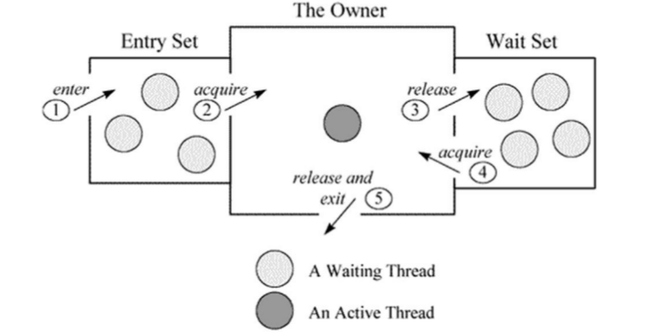

# Thread

## Thread

### 如果实现(或创建)一个线程? 

1. new Thread的方式: 
```java
// override run
boolean flag = false;
Thread t1 = new Thread("t1") {
    @Override
    public void run() {
        while (flag) {
            System.out.println("doing...");
        }
    }
};

// 传入一个task
Thread t2 = new Thread(() -> {
    while (flag) {
        System.out.println("doing...");
    }
}, "t2");
```

2. 继承Thread: 
```java
class Worker extends Thread {
    @Override
    public void run() {
        ///
    }
}
```

3. 创建线程池

4. 另外要注意, 实现线程的话要注意捕获InterrutedException. 

### 如何停止一个线程?

1. 停止一个线程, 可以通过声明一个volatile变量来控制其是否应该stop. 

```java
    private volatile Thread blinker;

    public void stop() {
        blinker = null;
    }

    public void run() {
        Thread thisThread = Thread.currentThread();
        while (blinker == thisThread) {
            try {
                Thread.sleep(interval);
            } catch (InterruptedException e){
            }
            repaint();
        }
    }
```

2. Thread.stop可以stop一个线程, 但是这个方法已经被废弃了. [原因](https://docs.oracle.com/javase/8/docs/technotes/guides/concurrency/threadPrimitiveDeprecation.html)如下: 调用stop后，被stop的线程会抛出一个ThreadDeath错误, 可能造成该线程stack中的对象状态不一致。

3. 中断线程使用Thread.interrupt. 上边强调了, 实现线程是要正确的响应中断. 

```java
    Thread t1 = new Thread(() -> {
        try {
            System.out.println("starting waiting");
            Thread.currentThread().sleep(10000);
        } catch (InterruptedException e) {
            System.out.println("interrupt");
        }
    });
    t1.start();
    Thread.sleep(1000);
    t1.interrupt();
```

4. Thread.suspend 和 Thread.resume这俩货可能导致死锁. 

suspend并不会释放锁. 假如A获取了lock然后suspend了, 本来B要resume线程A, 但是B要获取锁才能resume A. 死锁出现. 

### 线程的状态流转

[线程状态](../images/thread_state.jpg)

### notify()和notifyAll()有什么区别？

先要了解下Java的Monitor模型.


调用object.wait方法之后, 这时线程会进入等待队列, 等待被唤醒. 这就需要调用notify和notifyAll方法. 两者之间的区别:

- notify: JVM选择一个线程并唤醒. 至于选择谁, 这可以自由发挥. 
- notifyAll: 唤醒所有在这个条件等待的线程. 

多线程环境下使用单个的notify可能会导致一些线程被miss掉. 举个例子: 线程A, B都在等待条件C为真, 当C被触发了nitify之后, JVM选择了A执行, 这是A状态不满足, 但是B满足了但是B没有被唤醒. 所以这种情况下B就被miss了.

除了以下场景用notify, 其他都用notifyAll.
- 等待的线程是统一的, 比如几个worker都在等待一个任务队列;
- 单个任务的情况. 每次只产生一个任务.

### sleep()和 wait()有什么区别?

两个方法都会导致线程挂起. wait的含义主要是, 放弃锁, 并挂起线程. 属于锁的范畴. 而sleep属于系统的范畴. 

### 什么是Daemon线程？它有什么意义？

```java
Thread t1 = new Thread(() -> {
    while (true) {
        System.out.println("...");
        try {
            Thread.sleep(50);
        } catch (InterruptedException e) {
        }
    }
});
t1.setDaemon(true);

Thread t2 = new Thread(() -> {
    while (true) {
        System.out.println("***");
        try {
            Thread.sleep(50);
        } catch (InterruptedException e) {
        }
    }
});
t2.setDaemon(true);

t1.start(); t2.start();
```

java中有两类线程: User Thread 和 Daemon Thread. 我们可以通过Thread.setDaemon来设置一个线程为daemon状态. JVM中垃圾收集线程都是daemon的. 守护线程不会导致JVM退出(不管几个). 

### java如何实现多线程之间的通讯和协作？

lock, condition(await, signal, singalAll), wait, notify, notifyAll

### Lock和Condition

一个lock可以绑定多个Condition, 执行await, signal, signalAll的时候必须要先获取锁. 

### 什么是可重入锁（ReentrantLock）？

可重入锁是一个线程在锁内部重复的获取同一个锁. 可重入锁的lock和unlock必须成对出现. 

### 当一个线程进入某个对象的一个synchronized的实例方法后，其它线程是否可进入此对象的其它方法？

不会. 

普通同步方法，锁是当前实例对象。
静态同步方法，锁是当前类的class对象。
同步代码块，锁是括号中的对象。

### synchronized和java.util.concurrent.locks.Lock的异同？

首先两者性能上几乎没什么差别了, 所以性能不再是一个考量标准. 

ReentrantLock除了在加锁和内存语义上与内置锁相同, 它还提供了一些其他功能: 定时的锁等待(lock(timeout)), 可中断的锁等待(lockInterruptibly()), 公平锁, 以及实现非结构的加锁. synchronized加锁是基于代码块的, 一些复杂的场景比如分段锁它就不能实现, 只能依靠功能更强大的显示锁来完成. 

### 乐观锁和悲观锁的理解及如何实现，有哪些实现方式？

悲观锁认为数据一定会冲突, 所以在拿数据时先加锁. 
乐观锁主张不会发生冲突, 在提交是检测数据是否是预期值, 如果符合则提交. 

CAS(自旋)是乐观锁的实现.
现实锁是悲观锁的实现. 

### SynchronizedMap和ConcurrentHashMap有什么区别？

SynchronizedMap是基于synchronized实现的, 通过在每个方法上加锁. 所以多线程环境下会造成线程阻塞, 同时操作该map的只有一个线程. 

ConcurrentHashMap是优化过的适用于多线程环境. 1.8之前, 它采用了分段锁技术. 1.8以后替换成了CAS. 

### CopyOnWriteArrayList可以用于什么应用场景？

写少读多的场景.

### 什么叫线程安全？竞态条件?

在多线程环境下, 不需要使用任何额外的同步机制, 都能得到正确的结果. 

运算结果以来于线程的执行顺序时, 就会发生竞态条件. (java并发编程实战上举了一个星巴克等人的例子.)

### 同步有几种实现方法？

final, synchronized, lock, volatile(仅对读保持可见性, 一个线程修改值其它都能看到)

### volatile有什么用？能否用一句话说明下volatile的应用场景？

volatile可以提供了轻量的同步机制, 一个线程修改volatile的变量, 其它的线程都能读到它的最新值；禁止指令重排. 

运算结果不依赖于当前值(只有一个线程修改值)；不需要其他变量共同参与不变约束. 

### 请说明下java的内存模型及其工作流程。

Java中所有的实例, 静态变量, 数组都存储在JVM堆内存中, 堆内存是对所有的线程共享的. 每个线程都有自己的工作空间, 用于存储读局部变量的副本. 运算完成数据写回主内存. JMM就是处于主内存之上的内存抽象. JMM 通过控制主内存与每个线程的本地内存之间的交互,来为java程序员提供内存可见性保证。

举个例子: 线程A对变量v执行 +1 的操作(v的当前值=0), 然后线程B对变量执行 *2 操作. 

首先线程A要从主内存load变量v当前的值, 然后在自己的工作空间中进行计算, 然后刷到主内存；
稍后线程B从主内存load变量v的值, 然后在执行自己的 *1 操作, 然后刷到主内存. 
JMM做的事情是从内存读取数据, 向内存读取数据, 以及确保线程A, B之间的执行顺序, 确保最终结果是2, 而不是其它的值. 

### 为什么代码会重排序？

在执行程序时, 为了提高性能, 编译器和处理器常常会对指令做重排序. 重排序有三类:
- 编译器优化的重排序. 编译器(javac)在不改变程序单线程程序语义的前提下, 可以重新安排语句的执行顺序. 
- 指令级并行的冲排序. 处理器采用了指令并行技术将多条语句重叠执行. 
- 内存系统的重排序. 由于处理器使用缓存和读/写缓冲区,这使得加载和存储操作看上去可能是在乱序执行。

源代码 -> 编译器重排序 -> 指令级并行重排序 -> 内存系统重排序 -> 最终执行.

### 如何让一段程序并发的执行，并最终汇总结果？

1. 如果task都是相同的, 考虑使用forkjoin.
```
public class ForkJoinExample {
    public static void main(String[] args) throws InterruptedException, ExecutionException, TimeoutException {
        ForkJoinPool forkJoinPool = new ForkJoinPool(4);
        final Task task = new Task(65536);

        final ForkJoinTask<List<Integer>> result = forkJoinPool.submit(task);

        System.out.println(result.get(1000, TimeUnit.MILLISECONDS).size());
    }

    static class Task extends RecursiveTask<List<Integer>> {

        private int tasks = 0;

        public Task(int task) {
            this.tasks = task;
        }

        @Override
        protected List<Integer> compute() {
            List<Integer> list = new ArrayList<>();

            if (tasks > 16) {
                final ForkJoinTask<List<Integer>> left = new Task(tasks / 2).fork();
                final ForkJoinTask<List<Integer>> right = new Task(tasks / 2).fork();

                final List<Integer> leftJoin = left.join();
                final List<Integer> rightJoin = right.join();

                list.addAll(leftJoin);
                list.addAll(rightJoin);
            } else {
                list.add(tasks);
            }
            return list;
        }
    }
}
```

2. 
```
final ArrayList<Integer> list = new ArrayList<>();
final List<Integer> r = list.stream().parallel().map(i -> i + 1).collect(toList());
```

3. CompletableFuture

4. 使用CountdownLatch进行通知. 

### 如何合理的配置java线程池？如CPU密集型的任务，基本线程池应该配置多大？IO密集型的任务，基本线程池应该配置多大？用有界队列好还是无界队列好？任务非常多的时候，使用什么阻塞队列能获取最好的吞吐量？

CPU密集性的任务:core + 1. IO密集型: core * 2. 推荐使用有界队列, Java的线程池提供了Reject Policy. 
在任务非常多的时候LinkedBlockingQueue不错.

### 如何使用阻塞队列实现一个生产者和消费者模型？请写代码。

http://www.infoq.com/cn/articles/java-blocking-queue
使用阻塞队列有限使用方法: offer 和 poll. 

### 多读少写的场景应该使用哪个并发容器，为什么使用它？比如你做了一个搜索引擎，搜索引擎每次搜索前需要判断搜索关键词是否在黑名单里，黑名单每天更新一次。

CopyOnWriteArrayList这个适用与多读少些的场景. 
每天更新一次可以通过先把今天的构建然后直接替换引用. 

### 如何实现乐观锁（CAS）？如何避免ABA问题？

循环 CAS 回退

```
Object initialRef = null;
int initialStamp = 0;

AtomicStampedReference ref = new AtomicStampedReference(initialRef, initialStamp);
AtomicMarkableReference ref2 = new AtomicMarkableReference(initialRef, true);
```

### 读写锁可以用于什么应用场景？

多个线程同时读, 一个线程写. 典型的Master-Slave任务处理模式. 

### 如何实现一个流控程序，用于控制请求的调用次数？

1. 通过BlockingQueue, 定时更新Queue的配额, 获取成功则删掉元素, 如果失败则等待(超时).
2. AtomicInteger