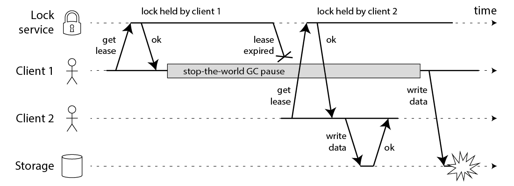
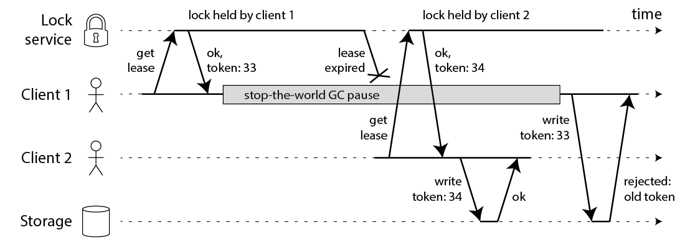

 Redis分布式锁
- 如何获取Redis单节点锁
    a. lock: SET lock-name random-value-for-this-lock NX PX 3000
    b. unlock: if redis.call("get", KEYS[1]) == ARGV[1] then return redis.call("del", KEYS[1]) else return 0 end
    c. time一定是需要的，这个称为锁的有效时间，为了防止一个程序获取锁了之后crash，导致这个锁永远释放不了。

这里有几个问题需要注意一下：
a. 获取锁的时候一定要执行一条命令，而不能先set再expire。因为如果程序执行了set命令之后crash，那么这个锁就永远释放不了。
b. random value这个是为了在释放锁的时候自己的锁被其他程序释放。
c. unlock一定要是lua脚本，因为这样才能确保该操作的原子行。试想如果把这两步分开操作，如果当前程序get value并判断相等，这时程序发生了较长的停顿，停顿事件超过了锁的有效时间，另外一个程序这时获取锁，当当前程序恢复过来删除key的时候，他恰恰把其他的锁删掉了。
d. 单节点锁是无法保证高可用的。但是这种获取锁的算法是没法工作在多节点架构的redis上的。比如A在Master节点获取了锁，随后Master挂掉，这时这个lock还没有同步到Salve上，这时B又在Slave上获取了相同的锁，导致了冲突。
e. 锁的过期事件应该设置成多少；

- Redlock分布式锁
- 如何获取锁：
    a. 获取当前时间。
    b. 按顺序一次向N个Redis节点发起获取锁的命令。命令要设置一个比锁的有效时间小的超时，不至于一个节点阻塞导致获取锁失败，或者锁的有效时间太短。如果一个redis获取失败，则立即转到下一个节点。
    c. 计算获取锁总共消耗了多少时间：当前时间-第一步的时间。如果客户端从多余N/2+1个节点成功获取了锁，并且时间差大于0,则获取锁成功，否则都为失败。
    d. 重新计算锁的有效时间=最初的锁的有效时间-获取锁的消耗时间。
    e. 如果锁获取失败了，则向所有的节点发起释放锁的命令。

疑问：
a. 考虑一下情况。A，B，C，D，E五个节点，假设客户端1获取了ABC三个节点上的锁，这时C挂了，但是C还没有持久化，这事C节点重启，客户端2在CDE上获取锁。antirez提出了延迟重启的概念，一个节点崩溃后，先等上一段事件，这个时间>锁的有效时间。
b. 为什么向所有的节点发送DEL命令。因为有一种问题，客户端发送了获取锁的命令，但是等待redis响应时失败了。因此一定要向所有的节点发送释放锁的命令。
c. 关于锁冲突
客户端1在获得锁之后发生了很长时间的GC pause，在此期间，它获得的锁过期了，而客户端2获得了锁。当客户端1从GC pause中恢复过来的时候，它不知道自己持有的锁已经过期了，它依然向共享资源（上图中是一个存储服务）发起了写数据请求，而这时锁实际上被客户端2持有，因此两个客户端的写请求就有可能冲突（锁的互斥作用失效了）。

e. 基于fencing token的优化

f. redlock有可能分配已经过期的锁
客户端1向ABCDEF请求锁，然后所有的节点响应成功。在计算了有效事件之后，客户端1进入了pause（各种原因吧），这时锁自动过期了。客户端2获取同一把锁，获取成功。这时对于同一资源有两个客户端获取了锁。

- 对于锁的分类
Ａ. 为了效率，协调各个客户端避免重复的工作。容忍锁失效。
Ｂ. 正确性. 这种情况下不允许锁失败．

- 基于zookeeper的分布式锁
A.客户端创建一个znode节点/lock，如果成功则该客户端获取锁成功。其他客户端在尝试创建的时候会失败
B.持有锁的客户端完成任务时候删掉/lock，释放该锁。其他客户端尝试获取锁便会成功。
C.Znode应该设置成ephemeral，它能保证如果创建znode的那个客户端崩溃（和server失联）则该node会自动删除。

相比于Redlock，这个锁没有过期时间。但是这种方式仍然有它的问题，zookeeper的自动删除机制是这样实现的。每个客户端和zookeeper之间维护着一个Session。如果server长时间收不到客户端的心跳那么就认为该客户端是过期的。通过这个session创建的所有ephemeral节点会被自动删除。
看一下下边这种执行步骤：
A.C1创建znode节点/lock，成功获取了锁
B.C1进入长时间的pause。
C.Zookeeper端认为该client已经失效然后删了它创建的节点。
D.C2获取同样一把锁。
E.C1恢复过来之后仍然感觉自己持有锁。（锁状态错误）

- Fencing token
Fencing token是为了解决上述提到的问题而提出的方案。在被锁保护的资源server上维护一个递增的fencing token，获取锁的时候同时拿到当前分配的token，再操作资源的时候会主动放弃持有旧的token的client。
