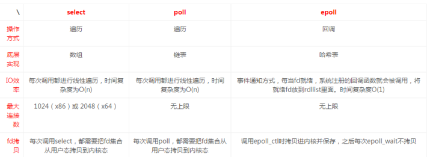

# Linux IO 模型

## 补充基础知识

### 文件描述符

在Linux操作系统中，所有的外部设备都抽象成文件对待，对一个文件的读写操作会调用内核提供的指令，返回一个文件描述符。文件描述符其实就是以非负整数命名的一些文件。我们可以查看/proc/${pid}/fd/目录下一些运行的进程的所有文件描述符。每个进程的文件描述符是隔离的，可以理解进程ID是其命名空间。POSIX定义了三个固定fd，STDIN_FILENO，STDOUT_FILENO和STDERR_FILENO三个常量，分别是0，1，2。

通过命令`ulimit -n`可以查看当前系统的文件打开数。如果进程创建超过这个数量的文件，则会出现`too many open files`错误。通常web server或者socket server服务多个client的时候会出现这个问题。

### Page Cache

页缓存（Page Cache）是位于内存和文件之间的缓冲区，它实际上也是一块内存区域，所有的文件IO（包括网络文件）都是直接和页缓存交互，操作系统通过一系列的数据结构，比如inode, address_space, struct page，实现将一个文件映射到页的级别，这些具体数据结构及之间的关系我们暂且不讨论，只需知道页缓存的存在以及它在文件IO中扮演着重要角色，很大一部分程度上，文件读写的优化就是对页缓存使用的优化。

### IO过程

以read举例，描述IO的详细过程。用户进程发起read 系统调用，数据会先被拷贝到操作系统内核的缓冲区中（数据的来源可能是fs，也可能是网络，如果是网络则会发生阻塞），然后才会从操作系统内核的缓冲区拷贝到应用程序的地址空间。所以说，当一个read操作发生时，它会经历两个阶段：

1.等待数据准备
2.将数据从内核空间拷贝到用户空间中

第一步根据其是否阻塞调用进程可以分成：阻塞和非阻塞IO；第二步根据其是否阻塞调用进程分为：同步和异步IO。

下边就以这两个指标衡量Linux中的集中IO模型。补充一点：我们讨论IO模型，多是和网络相关。磁盘IO一般都可以直接获得数据，不需要等待。

#### 同步阻塞（read/write）

在整个IO操作中用户进程被block，直到数据被拷贝到用户空间，或者产生错误。这种IO模型我们可以记为：同步-阻塞IO。

#### 同步非阻塞（O_NONBLOCK）

在linux中我们通过设置O_NONBLOCK，打开其非阻塞模式。这样用户进程发其read操作，如果内核中数据还没有ready，会立即返回错误(E_WOULDBLOCK)，应用程序可以一直循环这个操作知道数据可用。然后程序再次发起一个系统调用把数据拷贝到用户空间（这个阶段仍会阻塞用户进程）。这种IO模型我们可以记为：同步-非阻塞IO。

#### 异步阻塞（多路复用）

linux中通过select，poll，epoll实现多路复用技术。用户进程通过讲fd传递给select或者poll系统调动，等待其中的任何一个fd变成就绪状态。select和poll是顺序的扫描fd是否就绪，并且支持的fd数量有限(用数组保存fd)。epoll通过事件机制，当fd就绪时出发回调函数。select过程用户进程仍会被阻塞，当数据ready向用户空间拷贝数据的时候用户进程再次阻塞。这种IO模型我们可以记为：同步-阻塞IO。

这种IO模型的优势在于处理大量的fd，例如Netty中就实现了基于Select和Epoll的两种IO模型。

#### epoll两种工作模式：水平触发和边缘触发

level_triggered(水平触发)：当被监控的文件描述符上有可读写事件发生时，epoll_wait()会通知处理程序去读写。如果这次没有把数据一次性全部读写完(如读写缓冲区太小)，那么下次调用 epoll_wait()时，它还会通知你在上没读写完的文件描述符上继续读写，当然如果你一直不去读写，它会一直通知你。如果系统中有大量你不需要读写的就绪文件描述符，而它们每次都会返回，这样会大大降低处理程序检索自己关心的就绪文件描述符的效率。

edge_triggered(边缘触发)：当被监控的文件描述符上有可读写事件发生时，epoll_wait()会通知处理程序去读写。如果这次没有把数据全部读写完(如读写缓冲区太小)，那么下次调用epoll_wait()时，它不会通知你，也就是它只会通知你一次，直到该文件描述符上出现第二次可读写事件才会通知你。这种模式比水平触发效率高，系统不会充斥大量你不关心的就绪文件描述符。

这有两篇博客：[中文](http://www.cnblogs.com/yuuyuu/p/5103744.html)(上述文字摘抄自此)，[英文](https://www.garystringham.com/level-triggered-vs-edge-triggered-interrupts/)。

#### SignalIO

用户进程和kernel之间建立信号通信机制。当数据ready之后，kernel会发送信号通知用户进程，然后把数据从内核拷贝到用户空间。这种IO模型也叫做信号驱动。

它有一个很大的弊端是，一个进程和kernel之间只能创建一个信号通道，如果用户进程需要等待多个fd的话，则不能区分哪个ready。

#### 异步IO（AIO）

用户发起read操作之后，便立即返回。当数据ready并且拷贝到用户空间之后，系统内核给用户进程发送一个信号，告知read操作完成。整个过程用户进程都没有被阻塞。这种IO模型我们可以记为：异步-非阻塞IO。

#### 三者之间的差异

### 关于同步/异步，阻塞/非阻塞

#### 同步和异步

同步说的是请求方发出一个*调用*，在没有得到结果之前，该*调用*就不返回。一旦调用结束调用者便可拿到返回结果。

异步说的是请求方发出一个*调用*，这个调用直接就返回了。异步调用，请求方不会立马拿到调用结果，而是在调用发出后*被调用者*通过状态、通知来通知请求方，或把结果传给请求方注册的回调函数。

#### 阻塞和非阻塞

阻塞和非阻塞关注的是程序在等待调用结果（消息，返回值）时的状态。

阻塞调用是指调用结果返回之前，当前线程会被挂起。调用线程只有在得到结果之后才会返回。这段时间线程不能干其它的事情。

非阻塞调用指在不能立刻得到结果之前，该调用不会阻塞当前线程。

同步异步关注的是调用方，阻塞非阻塞关注的是被调用方。

以Http Call举例，如果直接通过http client发起请求获取结果那这就是一个同步调用；如果启动一个新的线程返回一个Future，那这就是一个异步调用。

还以Http Call举例，阻塞是经过一系列逻辑处理之后，返回结果；无阻塞则直接返回调用成功，调用者不会等待处理过程。等结果准备好之后以消息进行通知。