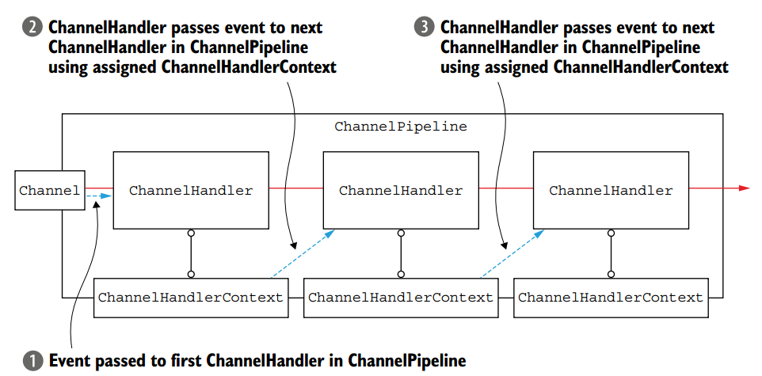
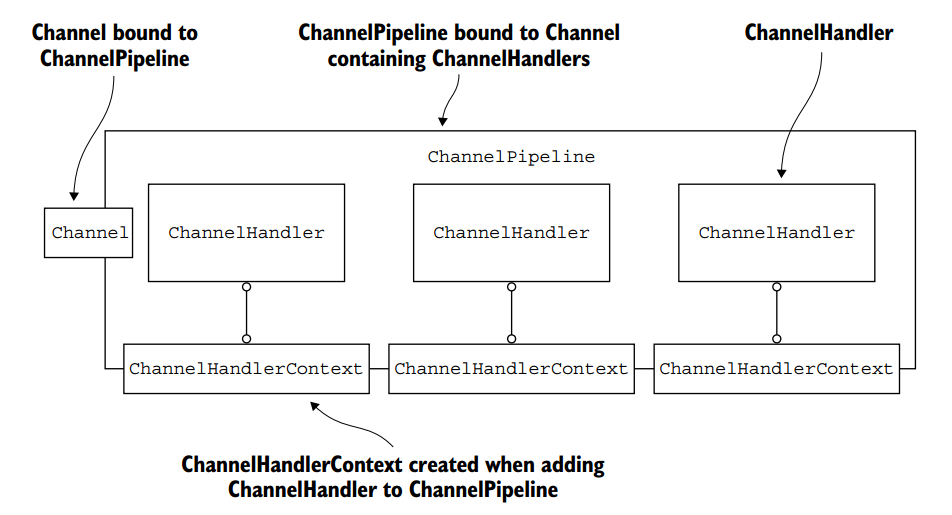

# Netty Data Stream Handling - read

上篇文章分析了EventLoop的实现，这篇文章我们主要看一下Netty中是怎么处理数据流的。涉及到几个核心抽象：Channel，ChannelHandler，ChannelPipeline。

- Channel是网络套接字的抽象，一个Tcp链接对应一个Channel实例。 Channel提供了read, write, connect, bind这些基本网络操作。在Netty中所有的IO操作都是异步的，可以立即返回但是不能立即得到操作结果，只能拿到一个ChannelFuture。ChannelFuture中记录了操作是成功还是失败。

- ChannelHandler是处理IO事件的主要抽象。

- ChannelPipeline以链表的形式编排多个ChannelHandler，让IO事件在各个Handler中流转。

## Channel和Unsafe

这段代码在上篇文章中我们已经读过了：EventLoop拿到了可用的OP_READ(Selection Key)，然后调用Unsafe读取数据。
```
private void processSelectedKey(SelectionKey k, AbstractNioChannel ch) {
        final AbstractNioChannel.NioUnsafe unsafe = ch.unsafe();
        try {
            if ((readyOps & (SelectionKey.OP_READ | SelectionKey.OP_ACCEPT)) != 0 || readyOps == 0) {
                unsafe.read();
            }
        } catch (CancelledKeyException ignored) {
            unsafe.close(unsafe.voidPromise());
        }
    }
```

先来说一下Unsafe和Channel的关系。Unsafe是定义在Channel中的一个接口，它定抽象了所有网络相关的操作。不同的Channel实例都会实各自的Unsafe，以辅助进行IO操作。以下代码是Unsafe接口的定义。

```
interface Unsafe {
        RecvByteBufAllocator.Handle recvBufAllocHandle();
        SocketAddress localAddress();
        SocketAddress remoteAddress();
        void register(EventLoop eventLoop, ChannelPromise promise);
        void bind(SocketAddress localAddress, ChannelPromise promise);
        void connect(SocketAddress remoteAddress, SocketAddress localAddress, ChannelPromise promise);
        void disconnect(ChannelPromise promise);
        void close(ChannelPromise promise);
        void closeForcibly();
        void deregister(ChannelPromise promise);
        void beginRead();
        void write(Object msg, ChannelPromise promise);
        void flush();
        ChannelPromise voidPromise();
        ChannelOutboundBuffer outboundBuffer();
    }
```

这里Unsafe对应的是NioByteUnsafe，我们来看下它的read方法的实现。

```
public final void read() {
            final ChannelConfig config = config();
            final ChannelPipeline pipeline = pipeline();
            final ByteBufAllocator allocator = config.getAllocator();
            final RecvByteBufAllocator.Handle allocHandle = recvBufAllocHandle();
            allocHandle.reset(config);

            ByteBuf byteBuf = null;
            boolean close = false;
            try {
                do {
                    // 1
                    byteBuf = allocHandle.allocate(allocator);
                    allocHandle.lastBytesRead(doReadBytes(byteBuf));
                    if (allocHandle.lastBytesRead() <= 0) {
                        byteBuf.release();
                        byteBuf = null;
                        close = allocHandle.lastBytesRead() < 0;
                        break;
                    }

                    allocHandle.incMessagesRead(1);
                    readPending = false;
                    // 2
                    pipeline.fireChannelRead(byteBuf);
                    byteBuf = null;
                } while (allocHandle.continueReading());

                allocHandle.readComplete();
                // 3
                pipeline.fireChannelReadComplete();

                if (close) {
                    closeOnRead(pipeline);
                }
            } catch (Throwable t) {
                handleReadException(pipeline, byteBuf, t, close, allocHandle);
            } finally {
                if (!readPending && !config.isAutoRead()) {
                    removeReadOp();
                }
            }
        }
```

这个方法主要的三个逻辑已经标识出来：
1.分配ByteBuf（关于ByteBuf可以看我的另一篇文章）。
2.读取的数据传递给Pipeline。
3.告知Pipeline数据读取完毕。

在说`pipeline.fireChannelRead(byteBuf);`之前我们先铺垫一些知识，这样我们读代码会更容易一下。

## Channel，Pipeline，EventLoop三者之间的关系

现在我们来研究一下Channel，Pipeline，EventLoop三者之间的关系。我们先来看一下Channel接口，它定义了获取eventLoop和pipeline这两个抽象方法。具体如何实现都丢到了子类。

```
public interface Channel extends AttributeMap, ChannelOutboundInvoker, Comparable<Channel> {
    EventLoop eventLoop();
    ChannelPipeline pipeline();
}
```

我们找到Channel的一个继承类AbtractChannel，我把和Eventloop，Pipeline相关的代码摘出来：

```
public abstract class AbstractChannel extends DefaultAttributeMap implements Channel {
    private final DefaultChannelPipeline pipeline;

    private volatile EventLoop eventLoop;

    protected AbstractChannel(Channel parent) {
        this.parent = parent;
        id = newId();
        unsafe = newUnsafe();
        pipeline = newChannelPipeline();
    }
    protected DefaultChannelPipeline newChannelPipeline() {
        return new DefaultChannelPipeline(this);
    }
    protected abstract class AbstractUnsafe implements Unsafe {
        public final void register(EventLoop eventLoop, final ChannelPromise promise) {
            if (eventLoop == null) {
                throw new NullPointerException("eventLoop");
            }
            if (isRegistered()) {
                promise.setFailure(new IllegalStateException("registered to an event loop already"));
                return;
            }
            if (!isCompatible(eventLoop)) {
                promise.setFailure(
                        new IllegalStateException("incompatible event loop type: " + eventLoop.getClass().getName()));
                return;
            }

            AbstractChannel.this.eventLoop = eventLoop;

            if (eventLoop.inEventLoop()) {
                register0(promise);
            } else {
                try {
                    eventLoop.execute(new Runnable() {
                        @Override
                        public void run() {
                            register0(promise);
                        }
                    });
                } catch (Throwable t) {
                    logger.warn(
                            "Force-closing a channel whose registration task was not accepted by an event loop: {}",
                            AbstractChannel.this, t);
                    closeForcibly();
                    closeFuture.setClosed();
                    safeSetFailure(promise, t);
                }
            }
        }
    }
}
```

AbstractChannel定义了eventloop和pipeline两个变量。所以Channel中的eventloop()，pipeline()返回的是这两个变量值。然后我们再来看它的构造函数：

- pipeline是创建了一个DefaultChannelPipeline实例。
- eventloop则是通过register方法设置的，我的另一篇[文章](http://www.jianshu.com/p/06ed59316381)解释了register是什么时候发生的。

那这三者的关系我们现在也搞清楚了：Channel在初始化的时候都会创建一个DefaultChannelPipeline实例，同时也会分配一个EventLoop。

## Pipeline Internal

在继续看channelpiple处理数据之前，我们先介绍ChannelPipeline是如何工作的。ChannelPipeline是Netty中处理事件的管道。它维护了一个链表来管理多个ChannelHandler。Pipeline定义了两种事件流向，分别是：inbound和outbound。对应的实现类分别是ChannelInboundHandler和ChannelOutboundHandler。如下图，从Socket读入数据传向程序内部，这是inbound流向；从程序向外流出并flush到Socket，这是outbound。

```
                                                 I/O Request
                                            via Channel or
                                        ChannelHandlerContext
                                                      |
  +---------------------------------------------------+---------------+
  |                           ChannelPipeline         |               |
  |                                                  \|/              |
  |    +---------------------+            +-----------+----------+    |
  |    | Inbound Handler  N  |            | Outbound Handler  1  |    |
  |    +----------+----------+            +-----------+----------+    |
  |              /|\                                  |               |
  |               |                                  \|/              |
  |    +----------+----------+            +-----------+----------+    |
  |    | Inbound Handler N-1 |            | Outbound Handler  2  |    |
  |    +----------+----------+            +-----------+----------+    |
  |              /|\                                  .               |
  |               .                                   .               |
  | ChannelHandlerContext.fireIN_EVT() ChannelHandlerContext.OUT_EVT()|
  |        [ method call]                       [method call]         |
  |               .                                   .               |
  |               .                                  \|/              |
  |    +----------+----------+            +-----------+----------+    |
  |    | Inbound Handler  2  |            | Outbound Handler M-1 |    |
  |    +----------+----------+            +-----------+----------+    |
  |              /|\                                  |               |
  |               |                                  \|/              |
  |    +----------+----------+            +-----------+----------+    |
  |    | Inbound Handler  1  |            | Outbound Handler  M  |    |
  |    +----------+----------+            +-----------+----------+    |
  |              /|\                                  |               |
  +---------------+-----------------------------------+---------------+
                  |                                  \|/
  +---------------+-----------------------------------+---------------+
  |               |                                   |               |
  |       [ Socket.read() ]                    [ Socket.write() ]     |
  |                                                                   |
  |  Netty Internal I/O Threads (Transport Implementation)            |
  +-------------------------------------------------------------------+
```

ChannelHandler主要负责事件处理，ChannelPipeline维护着多个handler。问题来了：如何在执行完Handler1之后调用它后边的Handler2呢？这就需要ChannelHandlerContext。ChannelHandlerContext是协调者，负责查找接下来要执行的是哪个handler。ChannelHandlerContext是Handler被添加到Pipeline时创建的。下图解释了Pipeline内部是如何工作的。



准确的说ChannelHandler要依附于Context，ChannelPipeline内部也是维护的Context的引用。由于我们平时打交道的都是handler和Pipeline，所以这么说更容易理解一些。下图解释了Pipeline，ChannelHandler，ChannelHandlerContext三者之间的关系。



## 回到pipeline的fireChannelRead

现在我们来看`pipeline.fireChannelRead`。

```
public final ChannelPipeline fireChannelRead(Object msg) {
        AbstractChannelHandlerContext.invokeChannelRead(head, msg);
        return this;
    }
```

head是pipeline默认的处于头部的ChannelHandler，它还有一个tail ChannelHandler处于Handler链的尾部。我们添加的ChannelHandler位于这两个Handler之间。上面的方法中我们看到了fireChannelRead内部实际调用了AbstractChannelHandlerContext的invokeChannelRead方法。我们进入这个方法：

```
    static void invokeChannelRead(final AbstractChannelHandlerContext next, Object msg) {
        final Object m = next.pipeline.touch(ObjectUtil.checkNotNull(msg, "msg"), next);
        EventExecutor executor = next.executor();
        if (executor.inEventLoop()) {
            next.invokeChannelRead(m);
        } else {
            executor.execute(new Runnable() {
                @Override
                public void run() {
                    next.invokeChannelRead(m);
                }
            });
        }
    }
```

第一行代码用于检测ByteBuf的内存泄露。然后调用head（HandlerContext）的invokeChannelRead方法。

```
private void invokeChannelRead(Object msg) {
    if (invokeHandler()) {
        try {
            ((ChannelInboundHandler) handler()).channelRead(this, msg);
        } catch (Throwable t) {
            notifyHandlerException(t);
        }
    } else {
        fireChannelRead(msg);
    }
}
```

接着调用HeadContext的channelRead方法：

```
public void channelRead(ChannelHandlerContext ctx, Object msg) throws Exception {
    ctx.fireChannelRead(msg);
}
```

关键部分，我们来看AbstractChannelHandlerContext.fireChannelRead方法，它又调用了invokeChannelRead方法，通过findContextInbound查找下一个被调用的HandlerContext。这样的话Handler就通过HandlerContext串联起来了。这样再调用invokeChannelRead时就会执行下个Handler的channelRead方法。

```
public ChannelHandlerContext fireChannelRead(final Object msg) {
    invokeChannelRead(findContextInbound(), msg);
    return this;
}

private AbstractChannelHandlerContext findContextInbound() {
    AbstractChannelHandlerContext ctx = this;
    do {
        ctx = ctx.next;
    } while (!ctx.inbound);
    return ctx;
}
```

这篇文章我们以Netty如何处理读入的事件为线索，主要介绍了Channel，Pipeline，Handler之间的关系，以及Pipeline内部工作机制。