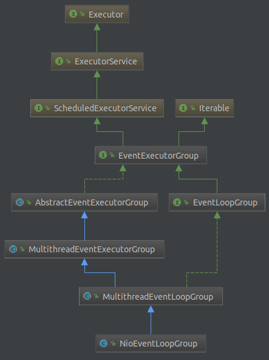
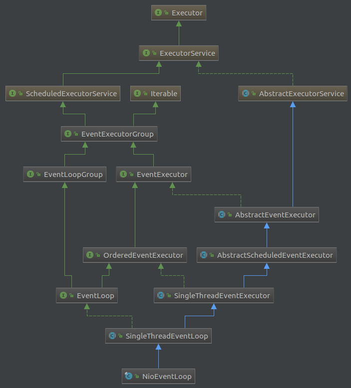
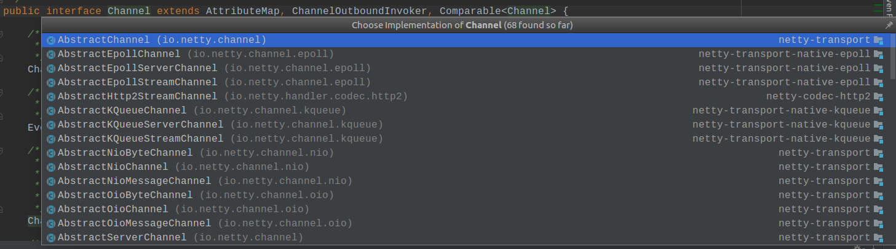
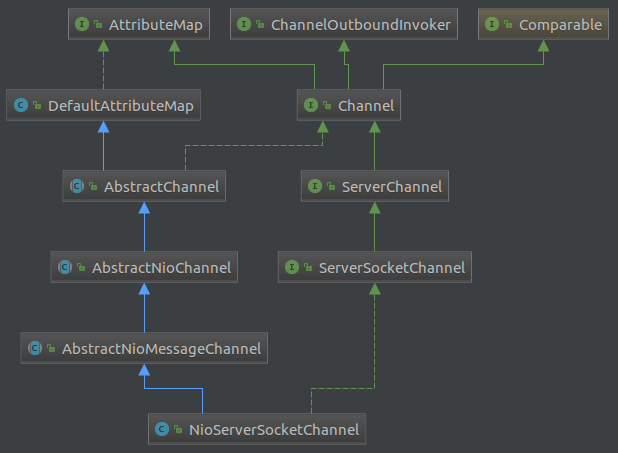

# Netty 源码解析

## 写在开始

这篇文章的主要目的是探寻Netty的启动过程，目的是搞清楚下边两个问题。看这篇文章至少需要具备一些Java知识，并且大概对Netty有一些了解。

1.ServerSocketChannel是何时，如何初始化的？
2.ServerSocketChannel是何时register到Eventloop？

## 准备工作

1. 下载源码：`git@github.com:netty/netty.git`。如果想看某个分支的代码可以checkout到那个分支。
2. 导入idea，idea会自动识别maven项目，下载依赖需要一段时间。
3. 编译，方便debug。首先build common：`cd common && mvn clean install`，然后就可以在idea中运行程序了。

## 源码分析

Netty源码中，有一个子项目叫examples。这里边自带了非常多Netty的例子，学习Netty，这些例子是最好的入门资料。我们打开DiscardServer这个示例，这个例子是最简单的入门示例。相当于学习一门新语言时的HelloWorld。从哪里开始看起呢？请看下边代码：

```Java
// Bind and start to accept incoming connections.
ChannelFuture f = b.bind(PORT).sync();
```

ServerBootstrap的bind方法是整个逻辑的入口。我们进入bind的实现，会跳转到AbstractBootstrap这个类，经过两个方法跳转我们开始看AbstractBootstrap.doBind方法：

```Java
    private ChannelFuture doBind(final SocketAddress localAddress) {
        final ChannelFuture regFuture = initAndRegister();
        final Channel channel = regFuture.channel();
        if (regFuture.cause() != null) {
            return regFuture;
        }
        if (regFuture.isDone()) {
            ChannelPromise promise = channel.newPromise();
            doBind0(regFuture, channel, localAddress, promise);
            return promise;
        } else {
            final PendingRegistrationPromise promise = new PendingRegistrationPromise(channel);
            regFuture.addListener(new ChannelFutureListener() {
                @Override
                public void operationComplete(ChannelFuture future) throws Exception {
                    Throwable cause = future.cause();
                    if (cause != null) {
                        promise.setFailure(cause);
                    } else {
                        promise.registered();
                        doBind0(regFuture, channel, localAddress, promise);
                    }
                }
            });
            return promise;
        }
    }
```

Netty代码质量非常高，通过读代码我们就能大概知道这个函数的功能（当然需要你有一点Netty相关的知识储备）：

- 初始化一个Channel，并把它register到Eventloop上。

- 绑定Address。

如果我们不想探究细节的话，其实前两个问题我们现在已经可以解答了：AbstractBootstrap类的doBind方法，通过调用initAndRegister创建一个Channel，并把它Register到Eventloop上。但是这样回答时我们还是非常不自信的，因为initAndRegister干了什么，doBind0又干了啥，我们没有一点头绪。所以，我们再接着向下深入一层（好的代码是有层次感的，而不是一个全能的大方法搞定一切）。

我们接下来展开initAndRegister方法，看这个方法有两个目的：channel如何init，如何register？

```Java
    final ChannelFuture initAndRegister() {
        Channel channel = null;
        try {
            channel = channelFactory.newChannel();
            init(channel);
        } catch (Throwable t) {
            if (channel != null) {
                channel.unsafe().closeForcibly();
            }
            return new DefaultChannelPromise(channel, GlobalEventExecutor.INSTANCE).setFailure(t);
        }

        ChannelFuture regFuture = config().group().register(channel);
        if (regFuture.cause() != null) {
            if (channel.isRegistered()) {
                channel.close();
            } else {
                channel.unsafe().closeForcibly();
            }
        }

        return regFuture;
    }
```

首先看try里边的逻辑：channelFactory.newChannel()。channelFactory是啥时初始化的呢？我们再回到DiscardServer类。

```Java
            ServerBootstrap b = new ServerBootstrap();
            b.group(bossGroup, workerGroup)
             .channel(NioServerSocketChannel.class)
             .handler(new LoggingHandler(LogLevel.INFO))
             .childHandler(new ChannelInitializer<SocketChannel>() {
                 @Override
                 public void initChannel(SocketChannel ch) {
                     ChannelPipeline p = ch.pipeline();
                     if (sslCtx != null) {
                         p.addLast(sslCtx.newHandler(ch.alloc()));
                     }
                     p.addLast(new DiscardServerHandler());
                 }
             });

```

我们跟进一下channel这个方法。

```Java
    public B channel(Class<? extends C> channelClass) {
        if (channelClass == null) {
            throw new NullPointerException("channelClass");
        }
        return channelFactory(new ReflectiveChannelFactory<C>(channelClass));
    }

    public B channelFactory(ChannelFactory<? extends C> channelFactory) {
        if (channelFactory == null) {
            throw new NullPointerException("channelFactory");
        }
        if (this.channelFactory != null) {
            throw new IllegalStateException("channelFactory set already");
        }

        this.channelFactory = channelFactory;
        return (B) this;
    }

```

channel调用了channelFactory这个方法，并把NioServerSocketChannel的ReflectiveChannelFactory传递给它。channelFactory把这个值传给了channelFactory属性。看到这其实已经有点谱了，channel是ReflectiveChannelFactory通过反射方式创建的NioServerSocketChannel的实例。

接下来我们开始走register这条线。执行register的逻辑是：`ChannelFuture regFuture = config().group().register(channel)`。我们跟进group()方法，发现最终这个方法返回的是AbstractBootstrap的group的属性。找一下这个group是何时set的。回到DiscardServer的代码中：`b.group(bossGroup, workerGroup)`，我们跟进这个group方法。进去后发现`super.group(parentGroup);`，调用了AbstractBootstrap的group方法，在这个方法中对group属性进行了赋值。所以，config().group()返回的是bossGroup。

接下来跟进register方法。register是EventLoopGroup接口中的方法。究竟该看哪个实现呢？再回到DiscardServer类，我们发现bossGroup是一个NioEventLoopGroup的实例。但是NioEventLoopGroup中并没有register方法。看一下NioEventLoopGroup的继承关系，如果它没实现肯定是在其父类中实现了。我们看一下它的继承关系：



去MultithreadEventLoopGroup中，确实有register方法的实现：

```Java
    public ChannelFuture register(Channel channel) {
        return next().register(channel);
    }
```

看一下next方法，调用super的next方法并返回一个EventLoop。然后调用EventLoop的register方法，把Channel注册到EventLoop上。OK，目前为止，前两个问题算是搞清楚了。

我们可以就此止步，也可以继续探究下去。因为眼前还有两个问题: next方法是如何实现的？register过程具体如何执行？我们尚不清楚。接下来看一下next方法是如何实现的：

```Java
    public EventLoop next() {
        return (EventLoop) super.next();
    }
```

在MultithreadEventLoopGroup的next方法直接调用了其父类MultithreadEventExecutorGroup的next方法，我门来看一下它是如何实现的：

```Java
    @Override
    public EventExecutor next() {
        return chooser.next();
    }
```

在这个类中有一个选择器chooser，chooser的赋值时机是在初始化这个类的时候，我们看其构造函数：

```Java
    protected MultithreadEventExecutorGroup(int nThreads, Executor executor, Object... args) {
        this(nThreads, executor, DefaultEventExecutorChooserFactory.INSTANCE, args);
    }
```

DefaultEventExecutorChooserFactory中实现了两个Chooser：PowerOfTwoEventExecutorChooser和GenericEventExecutorChooser。选择chooser时会进行判断，如果是executor的size是2的幂的话会选择使用第一种，这样更快一点，使用按位操作，否则的话逐个从线程池中拿。

chooser.next()选择出来的其实是NioEventExecutor，在这会进行强转，变成EventLoop类型？这里我们看一下EventLoop的继承关系。



我们回来接着再看register的逻辑。根据NioEventLoop的继承关系我们可以从SingleThreadEventLoop中找到register的实现。看一下代码：

```Java
    public ChannelFuture register(Channel channel) {
        return register(new DefaultChannelPromise(channel, this));
    }

    public ChannelFuture register(final ChannelPromise promise) {
        ObjectUtil.checkNotNull(promise, "promise");
        promise.channel().unsafe().register(this, promise);
        return promise;
    }
```

主要逻辑在下边的register方法。拿到channel，然后在调用channal的unsafe方法拿到一个Unsafe实例，然后由Unsafe执行register逻辑。又一个难题，Unsafe由是干啥的啊？ 都走到这儿了，硬着头皮往下看吧。我们跟进一下unsafe方法，发现这个方法是在Channel类中定义的。我们知道Channel提供了网络层的抽象，定义了基本的IO操作：bind，connect，read，write。我们打开Channel源码，发现其内部定义了Unsafe这个类。这个类的注释是这样写的：

```Java
    /**
     * <em>Unsafe</em> operations that should <em>never</em> be called from user-code. These methods
     * are only provided to implement the actual transport, and must be invoked from an I/O thread except for the
     * following methods:
     * <ul>
     *   <li>{@link #localAddress()}</li>
     *   <li>{@link #remoteAddress()}</li>
     *   <li>{@link #closeForcibly()}</li>
     *   <li>{@link #register(EventLoop, ChannelPromise)}</li>
     *   <li>{@link #deregister(ChannelPromise)}</li>
     *   <li>{@link #voidPromise()}</li>
     * </ul>
     */
    interface Unsafe {
```

和JDK的Unsafe一样，这个东西不是给普通用户提供的。那我们找一下它是什么时候，在什么地方实例化的。先看一下Channel的子类都有哪些：



先从第一个子类AbstractChannel看起。果然这个类定义了unsafe的变量，并且在构造器中进行了初始化：

```Java
    private final Unsafe unsafe;

    protected AbstractChannel(Channel parent) {
        this.parent = parent;
        id = newId();
        unsafe = newUnsafe();
        pipeline = newChannelPipeline();
    }
```

稍微回想一下，前边我们看过和channel相关的代码是通过ReflectiveChannelFactory创建一个NioServerSocketChannel实例。严重怀疑它们之间有密不可分的关系。看一下NioServerSocketChannel的继承关系：



果然，网上数三辈儿，就是AbstractChannel。我们回退到Factory创建channel的代码，如果不猜错我们肯定还能从那儿进入到AbstractChannel。在ReflectiveChannelFactory中我们找到了newChannel的实现逻辑：

```Java
    public T newChannel() {
        try {
            return clazz.newInstance();
        } catch (Throwable t) {
            throw new ChannelException("Unable to create Channel from class " + clazz, t);
        }
    }
```

我们已经知道这里clazz其实就是NioServerSocketChannel。我们进入NioServerSocketChannel，找到它的无参的构造函数：

```Java
    public NioServerSocketChannel() {
        this(newSocket(DEFAULT_SELECTOR_PROVIDER));
    }
```

先撇开newSocket这个方法，因为这需要Java的NIO知识。先搞清楚Channel的初始化逻辑是第一要务。这个构造函数调用了另一个构造函数：

```Java
    public NioServerSocketChannel(ServerSocketChannel channel) {
        super(null, channel, SelectionKey.OP_ACCEPT);
        config = new NioServerSocketChannelConfig(this, javaChannel().socket());
    }
```

这个构造函数里，调用了父类。我们继续跟进，进入AbstractNioMessageChannel。它的构造函数实现如下：

```Java
    protected AbstractNioMessageChannel(Channel parent, SelectableChannel ch, int readInterestOp) {
        super(parent, ch, readInterestOp);
    }
```

啥也没干，继续向上走，进入AbstractNioChannel。

```Java
    protected AbstractNioChannel(Channel parent, SelectableChannel ch, int readInterestOp) {
        super(parent);
        this.ch = ch;
        // SelectionKey.OP_ACCEPT
        this.readInterestOp = readInterestOp;
        try {
            ch.configureBlocking(false);
        } catch (IOException e) {
            try {
                ch.close();
            } catch (IOException e2) {
                if (logger.isWarnEnabled()) {
                    logger.warn(
                            "Failed to close a partially initialized socket.", e2);
                }
            }

            throw new ChannelException("Failed to enter non-blocking mode.", e);
        }
    }
```

AbstractNioChannel的构造函数也调用了其父类，我们在向上走一步，终于进到了AbstractChannel。

```Java
    protected AbstractChannel(Channel parent) {
        this.parent = parent;
        id = newId();
        unsafe = newUnsafe();
        pipeline = newChannelPipeline();
    }
```

挑重点：unsafe = newUnsafe()。但是newUnsafe方法却是一个抽象方法，我们还得退回到子类去找。在AbstractNioMessageChannel中发现了newUnsafe的定义：

```Java
    @Override
    protected AbstractNioUnsafe newUnsafe() {
        return new NioMessageUnsafe();
    }

    private final class NioMessageUnsafe extends AbstractNioUnsafe {
        ///
    }
```

所以，unsafe其实是一个NioMessageUnsafe的实例。不要忘了我们的初衷：我们是来看register实现的。但是NioMessageUnsafe里没有实现这个方法，只好在去递归它的父类。穿过它的父类：AbstractNioUnsafe，我们来到AbstractUnsafe，终于发现register方法。不容易啊！

```Java

public final void register(EventLoop eventLoop, final ChannelPromise promise) {

            AbstractChannel.this.eventLoop = eventLoop;

            if (eventLoop.inEventLoop()) {
                register0(promise);
            } else {
                try {
                    eventLoop.execute(new Runnable() {
                        @Override
                        public void run() {
                            register0(promise);
                        }
                    });
                } catch (Throwable t) {
                    logger.warn(
                            "Force-closing a channel whose registration task was not accepted by an event loop: {}",
                            AbstractChannel.this, t);
                    closeForcibly();
                    closeFuture.setClosed();
                    safeSetFailure(promise, t);
                }
            }
        }

        private void register0(ChannelPromise promise) {

                doRegister();

        }

```

register首先把eventloop传给了AbstractChannel的eventloop；然后调用register0方法，register0方法又调用doRegister()方法。我们跟进doRegister方法，发现它其实是AbstractChannel中定义的抽象方法。哇，又来。。。继续在其子类中搜索。在AbstractNioChannel中register方法在静静的等着我们：

```Java
    protected void doRegister() throws Exception {
        boolean selected = false;
        for (;;) {
            try {
                selectionKey = javaChannel().register(eventLoop().unwrappedSelector(), 0, this);
                return;
            } catch (CancelledKeyException e) {
                if (!selected) {
                    // Force the Selector to select now as the "canceled" SelectionKey may still be
                    // cached and not removed because no Select.select(..) operation was called yet.
                    eventLoop().selectNow();
                    selected = true;
                } else {
                    // We forced a select operation on the selector before but the SelectionKey is still cached
                    // for whatever reason. JDK bug ?
                    throw e;
                }
            }
        }
    }
```

javaChannel()拿的是最开始通过factory创建的channel，通过看AbstractNioChannel构造器可以知道；eventloop是我们调用register时的SingleThreadEventLoop。看到这才知道最底层原来是这样的：Channel是注册到了Selector上。

至此，channel的init和register两个过程我们都在代码里找到了线索。而且我们还搞清楚了register的真相：channel register到Selector上。差点忘了，我们还有一个bind逻辑还没有分析呢。但是理解bind逻辑需要对Netty的Pipeline有一些了解。所以，下一篇文章中会重点介绍一下Netty的Pipeline，以及完成bind逻辑的解读。