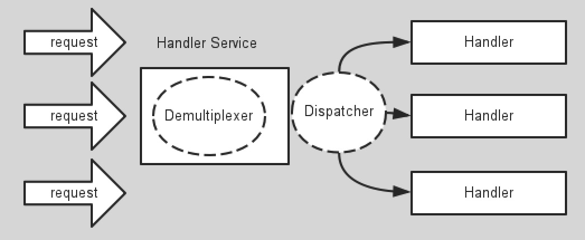

# 理论基础

## 关于异步和非阻塞

同步和异步：
同步说的是：发出一个*调用*时，在没有得到结果之前，该*调用*就不返回。一旦调用结束调用者就可以拿到返回结果。这个过程调用者一直在等待调用结果。

异步说的是：*调用*在发出之后，这个调用就直接返回了，所以现在还有返回结果。异步调用者不会立马拿到调用结果，而是在调用发出后*被调用者*通过状态、通知来通知调用者，或通过回调函数处理这个调用。

阻塞和非阻塞

阻塞和非阻塞关注的是程序在等待调用结果（消息，返回值）时的状态。

阻塞调用是指调用结果返回之前，当前线程会被挂起。调用线程只有在得到结果之后才会返回。这段时间线程不能干其它的事情。

非阻塞调用指在不能立刻得到结果之前，该调用不会阻塞当前线程。线程可以作其它事情。

https://www.zhihu.com/question/19732473

### 什么是异步？

### 什么是无阻塞？

### example

老张爱喝茶，废话不说，煮开水。
出场人物：老张，水壶两把（普通水壶，简称水壶；会响的水壶，简称响水壶）。
1 老张把水壶放到火上，立等水开。（同步阻塞）老张觉得自己有点傻
2 老张把水壶放到火上，去客厅看电视，时不时去厨房看看水开没有。（同步非阻塞）老张还是觉得自己有点傻，于是变高端了，买了把会响笛的那种水壶。水开之后，能大声发出嘀~~~~的噪音。
3 老张把响水壶放到火上，立等水开。（异步阻塞）老张觉得这样傻等意义不大

4 老张把响水壶放到火上，去客厅看电视，水壶响之前不再去看它了，响了再去拿壶。（异步非阻塞）

所谓同步异步，只是对于水壶而言。普通水壶，同步；响水壶，异步。虽然都能干活，但响水壶可以在自己完工之后，提示老张水开了。这是普通水壶所不能及的。同步只能让调用者去轮询自己（情况2中），造成老张效率的低下。所谓阻塞非阻塞，仅仅对于老张而言。立等的老张，阻塞；看电视的老张，非阻塞。情况1和情况3中老张就是阻塞的，媳妇喊他都不知道。虽然3中响水壶是异步的，可对于立等的老张没有太大的意义。所以一般异步是配合非阻塞使用的，这样才能发挥异步的效用。

http://blog.csdn.net/yqj2065/article/details/51757115

## Reactor 模型

Reactor说的是一种事件处理模型。该模型中的几个重要角色：
A.资源。资源指的是提供系统输入或者消费系统输出的资源。比如Socket套接字，比如读取一个文件。
B.Demultiplexer。事件分离器负责对资源进行轮寻等待，当资源ready的时候，分离器负责将资源发送给Dispatcher。
C.Dispatcher。处理Handler的注册和反注册。当资源到达时负责把资源分发到响应的Handler中。
D.Handler。对资源的请求处理。

Reactor可以通过少量的线程处理大量的并发访问。

###　multi reactor模型

### Don‘t call me，we will call you！

## Vertx线程模型

eventloop worker

### dont block eventloop线程

## Vertx in Action

verticle 并发问题

eventhandler
callback hell
解决方案

通信
eventbus

